# Aplicaciones recomendadas para alfabetización y educación especial

## Introducción

Las aplicaciones educativas pueden ser una herramienta complementaria para acompañar los procesos de enseñanza y aprendizaje en estudiantes con dificultades de lectoescritura, discapacidad intelectual, trastornos del lenguaje, TEA (Trastorno del Espectro Autista) y otras necesidades educativas especiales.

Es importante recordar que ninguna aplicación reemplaza la intervención pedagógica del docente. Su uso debe ser supervisado y adaptado a las necesidades particulares de cada estudiante.

---

# 1. Leo con Grin

## Imagen de referencia

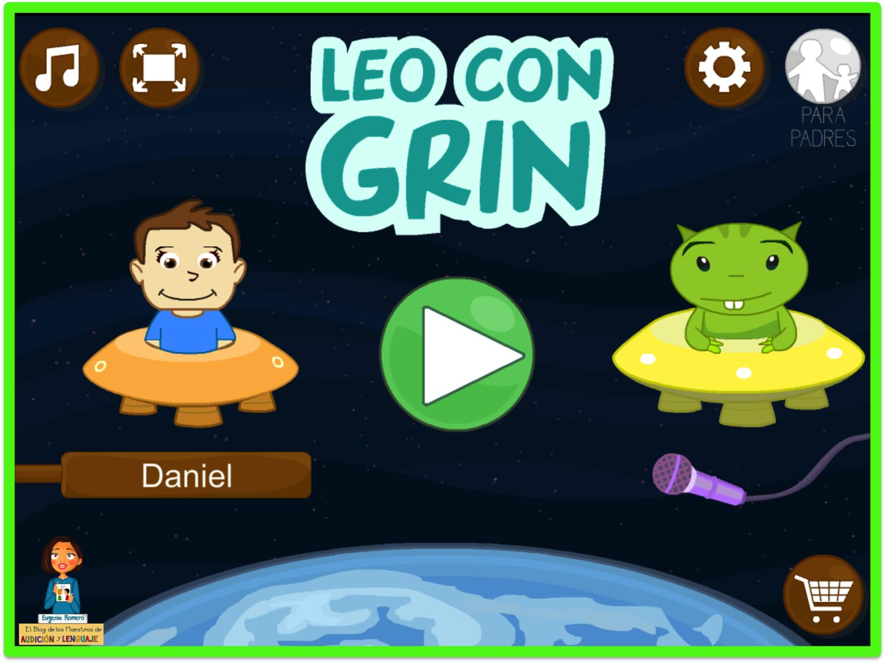

## Enlaces

* Sitio oficial: https://www.educaplanet.com
* Google Play: https://play.google.com/store/apps/details?id=air.educaplanet.grin.leo1.full

## ¿Qué trabaja?

* Reconocimiento de letras.
* Conciencia fonológica.
* Formación de sílabas.
* Formación de palabras.
* Lectura inicial.

## Recomendada para

* Estudiantes que todavía no leen.
* Dificultades iniciales de alfabetización.
* Retrasos en la adquisición de la lectura.
* Discapacidad intelectual leve.

## Ventajas

* Muy visual.
* Actividades cortas.
* Progresión gradual.
* Fácil de utilizar.

## Limitaciones

* Puede resultar básica para estudiantes que ya leen.
* No trabaja específicamente palabras agudas, graves y esdrújulas.

## Recomendación CEE 23

⭐⭐⭐⭐⭐ Muy recomendable para alfabetización inicial.

## Tutorial en video

* Ver tutorial: https://youtu.be/Z9agekZST0Y

---

# 2. ABC Dinos

## Imagen de referencia

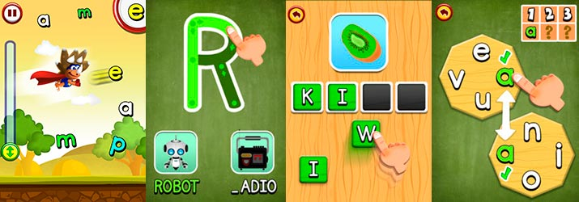

## Enlaces

* Google Play:
  https://play.google.com/store/apps/details?id=com.didactoons.abc.dinos

## ¿Qué trabaja?

* Reconocimiento de letras.
* Asociación letra-sonido.
* Formación de sílabas.
* Lectura inicial.

## Recomendada para

* Nivel inicial.
* Primer ciclo.
* Estudiantes con dificultades de alfabetización.

## Ventajas

* Muy atractiva visualmente.
* Fácil navegación.
* Actividades lúdicas.

## Recomendación CEE 23

⭐⭐⭐⭐ Muy recomendable.

## Tutorial en video

* Ver tutorial: https://youtu.be/uPFvVLf5qGc

---

# 3. Smile and Learn

## Imagen de referencia

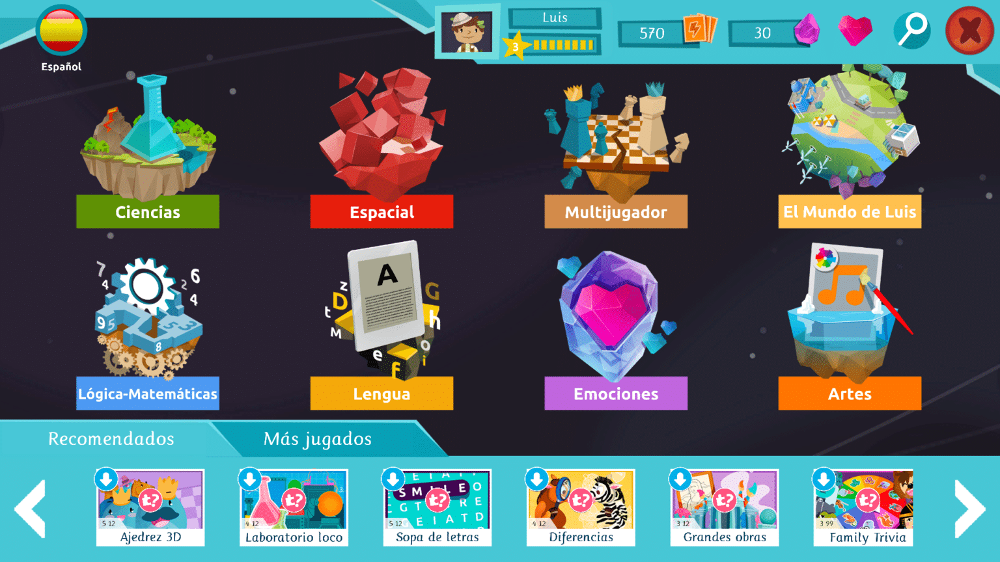

## Enlaces

* Sitio oficial:
  https://www.smileandlearn.com

## ¿Qué trabaja?

* Lectoescritura.
* Comprensión lectora.
* Atención.
* Memoria.
* Desarrollo cognitivo.

## Recomendada para

* Educación inicial.
* Educación primaria.
* Educación especial.

## Ventajas

* Amplio catálogo de actividades.
* Diferentes niveles de dificultad.

## Recomendación CEE 23

⭐⭐⭐⭐ Muy recomendable.

## Tutorial en video

* Presentación de la plataforma: https://youtu.be/-6wNTgwUKV4

---

# 4. Jclic

## Imagen de referencia

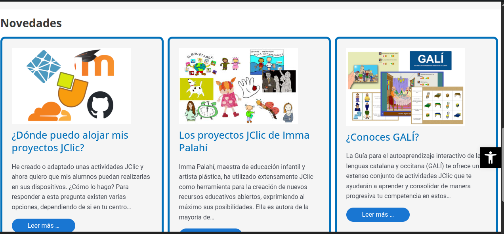

## Enlaces

* Sitio oficial:
  https://clic.xtec.cat

## ¿Qué trabaja?

* Actividades personalizadas.
* Comprensión lectora.
* Separación silábica.
* Palabras agudas, graves y esdrújulas.
* Matemática.
* Memoria.

## Recomendada para

* Todos los niveles educativos.
* Adaptaciones curriculares.

## Ventajas

* Permite crear actividades propias.
* Gran cantidad de recursos disponibles.

## Recomendación CEE 23

⭐⭐⭐⭐⭐ Una de las herramientas más útiles para docentes.

---

# 5. ARASAAC

## Imagen de referencia

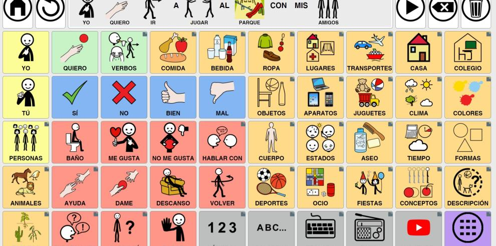

## Enlaces

* Sitio oficial:
  https://arasaac.org

## ¿Qué trabaja?

* Comunicación aumentativa y alternativa.
* Pictogramas.
* Comprensión visual.
* Anticipación de actividades.
* Rutinas.

## Recomendada para

* TEA.
* Trastornos del lenguaje.
* Estudiantes no verbales.
* Educación especial.

## Ventajas

* Gratuita.
* Gran cantidad de recursos.
* Amplia comunidad educativa.

## Recomendación CEE 23

⭐⭐⭐⭐⭐ Imprescindible.

---

# 6. LetMeTalk

## Imagen de referencia

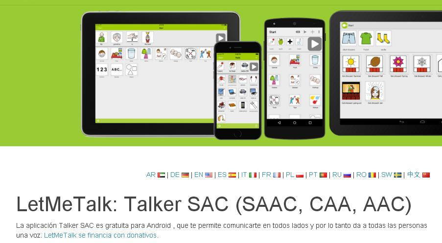

## Enlaces

* Sitio oficial:
  https://letmetalk.info

## ¿Qué trabaja?

* Comunicación mediante pictogramas.
* Construcción de frases.
* Expresión de necesidades.

## Recomendada para

* Estudiantes no verbales.
* Trastornos del lenguaje.
* TEA.

## Ventajas

* Gratuita.
* Funciona sin conexión.
* Fácil personalización.

## Recomendación CEE 23

⭐⭐⭐⭐⭐ Muy recomendable.

---

# 7. Cboard

## Imagen de referencia

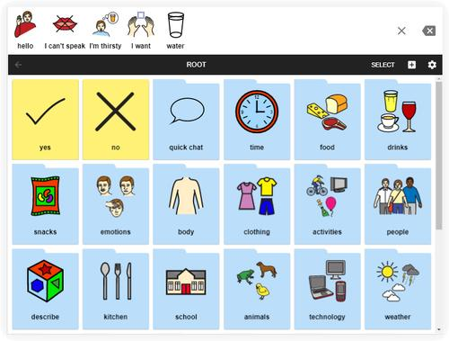

## Enlaces

* Sitio oficial:
  https://www.cboard.io

## ¿Qué trabaja?

* Comunicación alternativa.
* Pictogramas.
* Expresión de necesidades.
* Construcción de mensajes.

## Recomendada para

* TEA.
* Trastornos del lenguaje.
* Educación especial.

## Ventajas

* Muy sencilla.
* Multiplataforma.
* Gratuita.

## Recomendación CEE 23

⭐⭐⭐⭐⭐ Muy recomendable.

---

# 8. Kahoot!

## Imagen de referencia

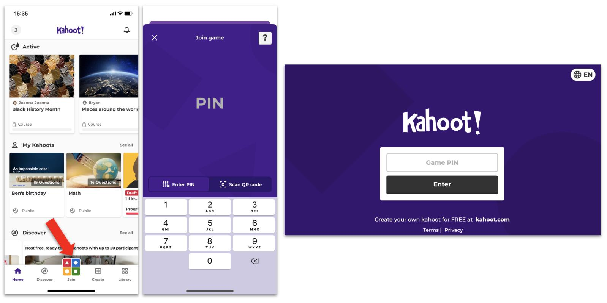

## Enlaces

* Sitio oficial:
  https://kahoot.com

## ¿Qué trabaja?

* Evaluación formativa.
* Comprensión lectora.
* Memoria.
* Atención.
* Participación grupal.

## Recomendada para

* Educación primaria.
* Educación secundaria.
* Educación especial con acompañamiento docente.

## Ventajas

* Muy motivadora.
* Permite aprender jugando.
* Puede utilizarse desde celulares, tablets o computadoras.
* El docente puede crear actividades personalizadas.

## Limitaciones

* Requiere conexión a Internet.
* Algunos estudiantes pueden necesitar apoyo para responder dentro del tiempo establecido.

## Recomendación CEE 23

⭐⭐⭐⭐⭐ Excelente para actividades grupales y repasos.

## Tutorial en video

* Quiz en Kahoot!: https://youtu.be/VTGVe5w9AdQ
* Crear un Kahoot!: https://youtu.be/ePh_VP4mlkc?list=PL-50N2LhNQCUxygfzjJXH-cLlzLzTfINi

---

# 9. Educaplay

## Imagen de referencia

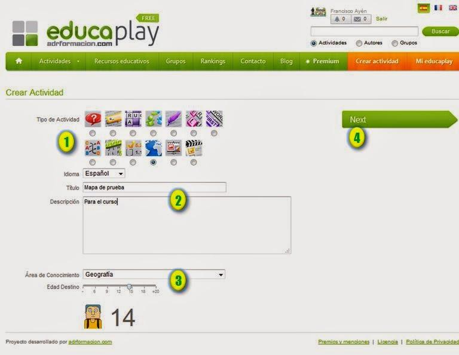

## Enlaces

* Sitio oficial:
  https://www.educaplay.com

## ¿Qué trabaja?

* Lectoescritura.
* Comprensión lectora.
* Asociación de conceptos.
* Memoria.
* Vocabulario.

## Recomendada para

* Todos los niveles educativos.
* Educación especial.
* Adaptaciones curriculares.

## Ventajas

* Permite crear actividades propias.
* Sopas de letras.
* Crucigramas.
* Relacionar columnas.
* Completar palabras.
* Dictados.
* Adivinanzas.

## Recomendación CEE 23

⭐⭐⭐⭐⭐ Muy recomendable para personalizar actividades según cada estudiante.

## Tutorial en video

* Tutorial de Educaplay: https://youtu.be/_P2P9ogAUcc
* Crear actividades interactivas para tu clase con Educaplay: https://youtu.be/ROb8lQSrDwY
* Cómo usar Educaplay paso a paso: https://youtu.be/f3HdQGxgk_U

---

# 10. Wordwall

## Imagen de referencia

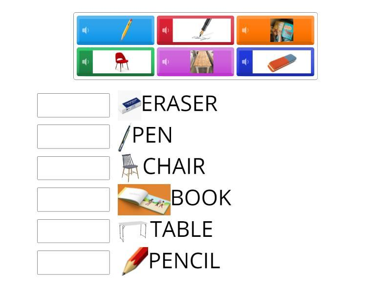

## Enlaces

* Sitio oficial:
  https://wordwall.net

## ¿Qué trabaja?

* Lectura.
* Escritura.
* Comprensión.
* Memoria.
* Atención.

## Recomendada para

* Educación especial.
* Nivel inicial.
* Nivel primario.
* Adaptaciones curriculares.

## Ventajas

* Muy visual.
* Fácil de utilizar.
* Gran cantidad de plantillas listas para usar.
* Permite imprimir actividades.

## Actividades destacadas

* Ruleta.
* Tarjetas.
* Emparejar imágenes.
* Ordenar palabras.
* Juegos de memoria.
* Cuestionarios.

## Recomendación CEE 23

⭐⭐⭐⭐⭐ Una de las herramientas más útiles para docentes de apoyo y educación especial.

## Tutorial en video

* Crea tu primera actividad paso a paso: https://youtu.be/Z-GfU3kXaTg
* Juego interactivo en minutos, versión gratuita: https://youtu.be/zIirjg26Nt4
* Qué es Wordwall, registro y realización de un juego: https://youtu.be/QcJxE-e30y4

---

# 11. Pilas Bloques

## Imagen de referencia

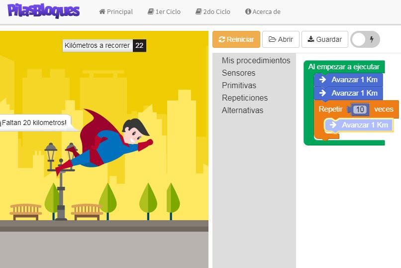

## Enlaces

* Sitio oficial:
  https://pilasbloques.program.ar

## ¿Qué trabaja?

* Pensamiento lógico.
* Resolución de problemas.
* Secuencias.
* Orientación espacial.
* Programación por bloques.

## Recomendada para

* Estudiantes que se inician en programación.
* Desarrollo del pensamiento computacional.
* Educación especial con acompañamiento.

## Ventajas

* Gratuita.
* En español.
* Desarrollada para el ámbito educativo argentino.
* Similar a Scratch pero más simple.

## Recomendación CEE 23

⭐⭐⭐⭐ Muy recomendable para trabajar lógica y secuencias de forma lúdica.

---

# 12. Genially

## Imagen de referencia

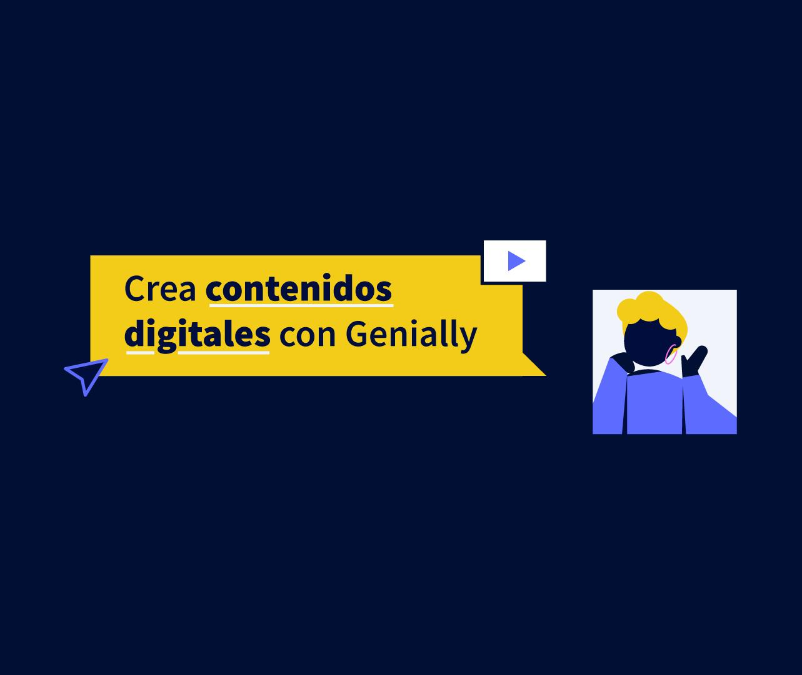

## Enlaces

* Sitio oficial:
  https://genial.ly

## ¿Qué trabaja?

* Comprensión lectora.
* Alfabetización.
* Atención.
* Memoria.
* Secuencias.
* Actividades interactivas.

## Recomendada para

* Todos los niveles educativos.
* Educación especial.
* Adaptaciones curriculares.

## Ventajas

* Permite crear juegos personalizados.
* Escape rooms educativos.
* Presentaciones interactivas.
* Material visual muy atractivo.

## Recomendación CEE 23

⭐⭐⭐⭐⭐ Excelente para crear actividades adaptadas a cada estudiante.

## Tutorial en video

* Cómo usar Genially en 2026: https://youtu.be/0QA_f8lJDS0
* Cómo crear recursos accesibles con Genially: https://youtu.be/1kQXXv6rF1Y
* Tutorial de Genially para docentes: https://youtu.be/FGpRRh0TFj8
* Tutorial Genially 013: rompecabezas: https://youtu.be/9hCyGMOfr7I

---

# Recomendación rápida según la necesidad

| Necesidad                         | Aplicación recomendada                      |
| --------------------------------- | ------------------------------------------- |
| No reconoce letras                | Leo con Grin, ABC Dinos                     |
| No forma sílabas                  | Leo con Grin                                |
| Lectura inicial                   | Leo con Grin, ABC Dinos                     |
| Comprensión lectora               | Smile and Learn, Educaplay, Genially        |
| Comunicación mediante pictogramas | ARASAAC                                     |
| Comunicación alternativa          | LetMeTalk, Cboard                           |
| TEA                               | ARASAAC, Cboard, LetMeTalk                  |
| Estudiantes no verbales           | LetMeTalk, Cboard                           |
| Alfabetización complementaria     | Educaplay                                   |
| Actividades personalizadas        | Jclic, Educaplay, Wordwall, Genially        |
| Pensamiento lógico                | Pilas Bloques                               |
| Evaluaciones grupales             | Kahoot!                                     |

---

# Recomendación institucional

Para el trabajo diario en el CEE 23 se recomienda priorizar las siguientes herramientas:

### Alfabetización

* Leo con Grin
* ABC Dinos

### Comunicación aumentativa y alternativa

* ARASAAC
* LetMeTalk
* Cboard

### Actividades personalizadas

* Wordwall
* Educaplay
* Genially
* Jclic

### Pensamiento lógico y computacional

* Pilas Bloques

### Evaluaciones y actividades grupales

* Kahoot!

Estas herramientas permiten adaptar los contenidos según las necesidades individuales de cada estudiante, favoreciendo la inclusión y la participación activa en las propuestas pedagógicas.

---

# Caso específico: palabras agudas, graves y esdrújulas

Si el estudiante ya puede leer palabras pero no logra identificar si son agudas, graves o esdrújulas, generalmente el problema no está en la lectura sino en la identificación de la sílaba tónica.

En estos casos suele resultar más efectivo:

* Separar palabras en sílabas.
* Identificar la sílaba que suena más fuerte.
* Realizar palmadas por sílaba.
* Utilizar colores para marcar la sílaba tónica.
* Crear actividades específicas en Jclic.
* Crear juegos interactivos en Genially.
* Utilizar tarjetas impresas y recursos manipulativos.

Actualmente existen pocas aplicaciones enfocadas específicamente en la clasificación de palabras según su acentuación, por lo que las actividades personalizadas diseñadas por el docente suelen ofrecer mejores resultados.
