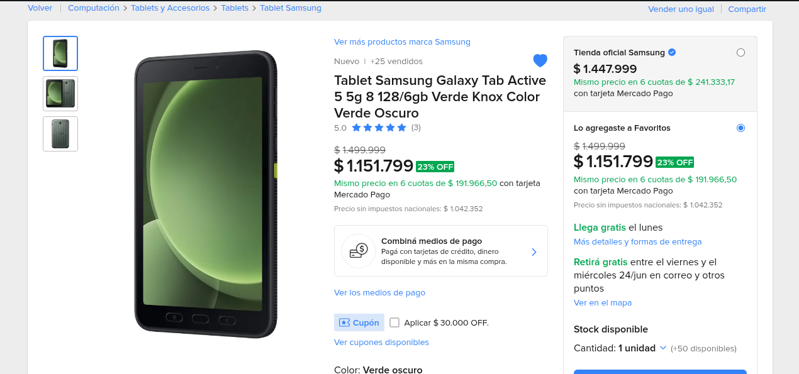
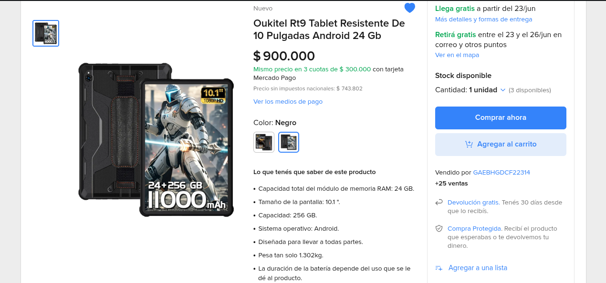
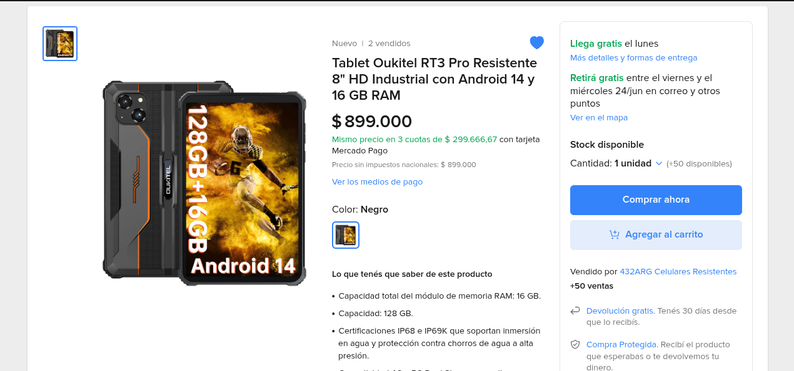
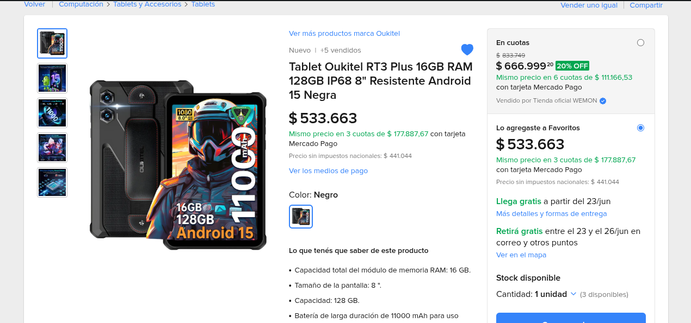
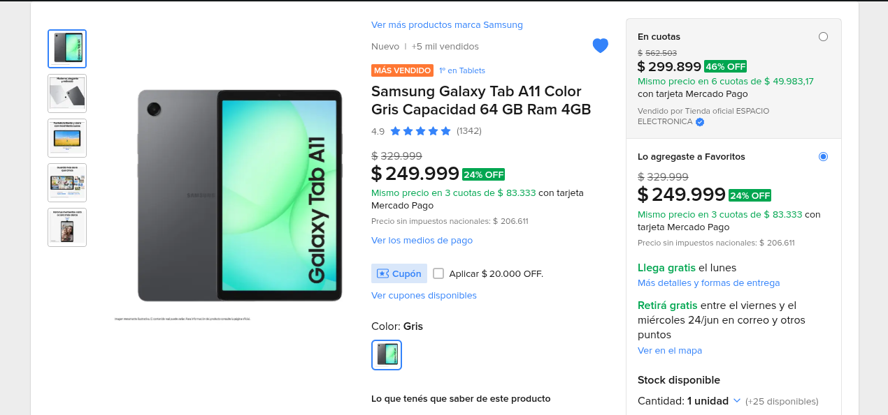
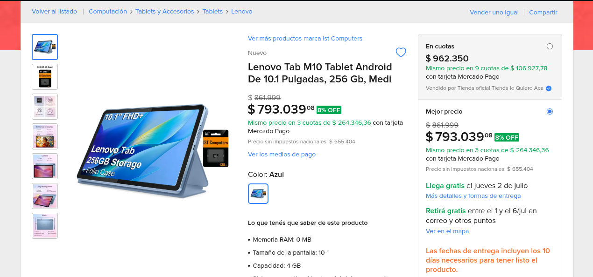

# Propuesta de Tablets para la Escuela de Educacion Especial N. 23

## Fundamentacion

La incorporacion de tablets en la Escuela de Educacion Especial N. 23 permitira ampliar las posibilidades de ensenanza, comunicacion, inclusion y acceso a recursos digitales adaptados a las necesidades de los estudiantes.

Estos dispositivos pueden utilizarse para:

* Comunicacion Aumentativa y Alternativa (CAA / SAAC).
* Actividades de lectoescritura.
* Desarrollo de habilidades cognitivas.
* Estimulacion visual y auditiva.
* Juegos educativos adaptados.
* Produccion de contenidos multimedia.
* Videollamadas y comunicacion institucional.
* Actividades de autonomia personal.
* Uso de aplicaciones especificas para estudiantes con discapacidad.

Debido a las caracteristicas de la poblacion destinataria, se considera importante priorizar equipos resistentes a golpes, humedad y uso intensivo diario.

---

# Requisitos Tecnicos Recomendados

## Minimos sugeridos

* Pantalla de 8" a 11".
* Android actualizado.
* 4 GB de RAM como minimo.
* 64 GB de almacenamiento interno.
* WiFi doble banda.
* Bluetooth.
* Camara frontal.
* Bateria de larga duracion.
* Compatibilidad con fundas reforzadas.

## Deseables

* Certificacion IP68 o superior.
* Proteccion contra agua y polvo.
* Resistencia a caidas.
* Actualizaciones garantizadas por varios anos.

---

# Accesorios Recomendados

## Fundas antigolpes

Se recomienda que cada tablet incluya:

* Funda EVA de alta densidad.
* Esquinas reforzadas.
* Soporte trasero.
* Asa de transporte.
* Proteccion integral de bordes.

## Protectores de pantalla

* Vidrio templado.
* Cobertura completa.

## Tapones antipolvo

Resultan especialmente utiles para proteger los puertos de carga y conectividad frente a:

* Polvo.
* Arena.
* Derrame de liquidos.
* Saliva.
* Migas y suciedad.

### Ejemplos

* Pendiente de agregar enlaces.

---

# Tablets Recomendadas

# 1. Samsung Galaxy Tab Active5

Pendiente de agregar.

## Precio estimado

$700.000 a $1.000.000 ARS 

## Enlace

Pendiente de agregar.

## Caracteristicas principales

* Pantalla de 8".
* 8 GB RAM.
* 128 GB almacenamiento.
* Certificacion IP68.
* Samsung Knox.
* Android actualizado.
* Disenada para uso industrial.

## Ventajas

* Resistente al agua.
* Resistente al polvo.
* Excelente resistencia a golpes.
* Muy buena autonomia.
* Soporte oficial Samsung.
* Repuestos y accesorios disponibles.

## Ideal para

* Uso intensivo diario.
* Estudiantes con dificultades motrices.
* Contextos donde existen caidas frecuentes.
* Instituciones que buscan una inversion a largo plazo.

## Evaluacion

5/5

---

# 2. Oukitel RT9

Pendiente de agregar.

## Precio estimado

$500.000 a $650.000 ARS

## Enlace

Pendiente de agregar.

## Caracteristicas principales

* Pantalla de 10".
* Certificacion IP68/IP69K.
* Proteccion militar.
* Bateria de 11.000 mAh.
* Estructura rugerizada.

## Ventajas

* Muy resistente.
* Excelente bateria.
* No requiere funda especial para uso basico.
* Ideal para ambientes exigentes.

## Ideal para

* Uso intensivo.
* Actividades al aire libre.
* Estudiantes con alta tendencia a golpes o caidas.

## Evaluacion

5/5

---

# 3. Oukitel RT3 Pro

Pendiente de agregar.

## Precio estimado

$450.000 a $600.000 ARS

## Enlace

Pendiente de agregar.

## Caracteristicas principales

* Pantalla de 8".
* Certificacion IP68/IP69K.
* Diseno compacto.
* Android actualizado.

## Ventajas

* Facil de sostener.
* Menor peso.
* Muy resistente.

## Ideal para

* Ninos pequenos.
* Comunicacion aumentativa.
* Actividades individuales.

## Evaluacion

4/5

---

# 4. Oukitel RT3 Plus

Pendiente de agregar.

## Precio estimado

$500.000 a $650.000 ARS

## Enlace

Pendiente de agregar.

## Caracteristicas principales

* Pantalla de 8".
* Proteccion IP68.
* Mayor almacenamiento.
* Diseno rugerizado.

## Ventajas

* Compacta.
* Muy resistente.
* Excelente autonomia.

## Ideal para

* Uso individual.
* Comunicacion y actividades educativas.

## Evaluacion

4/5

---

# 5. Samsung Galaxy Tab A11

Pendiente de agregar.

## Precio estimado

$250.000 a $400.000 ARS

## Enlaces

Pendiente de agregar.

## Funda compatible

Pendiente de agregar.

## Caracteristicas principales

* 4 GB RAM.
* 64 GB almacenamiento.
* Android actualizado.
* Excelente relacion costo-beneficio.

## Ventajas

* Economica.
* Buen rendimiento.
* Facil acceso a accesorios.
* Marca reconocida.

## Consideraciones

No posee resistencia especial al agua o golpes.

Se recomienda:

* Funda reforzada.
* Protector templado.
* Tapones antipolvo.

## Ideal para

* Escuelas con presupuesto limitado.
* Uso educativo general.
* Comunicacion y lectoescritura.

## Evaluacion

4/5

---

# 6. Lenovo Tab M10 / M11

Pendiente de agregar.

## Precio estimado

$350.000 a $500.000 ARS

## Enlace

Pendiente de agregar.

## Caracteristicas principales

* Pantalla amplia.
* Buen rendimiento.
* Construccion solida.

## Ventajas

* Excelente experiencia multimedia.
* Buena autonomia.
* Pantalla comoda para actividades educativas.

## Ideal para

* Lectoescritura.
* Juegos educativos.
* Actividades grupales.

## Evaluacion

4/5

---

# Cuadro Comparativo

| Modelo | Pantalla | Agua/Polvo | Golpes | Rendimiento | Uso recomendado |
| --- | --- | --- | --- | --- | --- |
| Samsung Active5 | 8" | Excelente | Excelente | Excelente | Uso institucional intensivo |
| Oukitel RT9 | 10" | Excelente | Excelente | Muy bueno | Maxima resistencia |
| Oukitel RT3 Pro | 8" | Excelente | Excelente | Muy bueno | Ninos pequenos |
| Oukitel RT3 Plus | 8" | Excelente | Excelente | Muy bueno | Ninos pequenos |
| Samsung A11 | 11" | Basico | Medio (con funda) | Muy bueno | Mejor costo-beneficio |
| Lenovo M10/M11 | 10-11" | Basico | Medio (con funda) | Muy bueno | Uso educativo general |

---

# Recomendacion Final

## Opcion A - Maxima durabilidad

1. Samsung Galaxy Tab Active5.
2. Funda industrial reforzada.
3. Protector templado.
4. Tapones antipolvo.

## Opcion B - Mejor relacion costo / beneficio

1. Samsung Galaxy Tab A11.
2. Funda reforzada.
3. Protector templado.
4. Tapones antipolvo.

Permite adquirir una mayor cantidad de dispositivos manteniendo un rendimiento adecuado para actividades educativas.

## Opcion C - Maxima resistencia fisica

1. Oukitel RT9.
2. Oukitel RT3 Pro.
3. Oukitel RT3 Plus.

Recomendadas cuando la prioridad principal es la proteccion frente a golpes, caidas y exposicion al agua.

---

# Conclusion

Las tablets constituyen una herramienta de accesibilidad que favorece la inclusion educativa, la comunicacion y el desarrollo de habilidades cognitivas y sociales.

La adquisicion de dispositivos resistentes, acompanados de fundas protectoras y accesorios adecuados, permitira maximizar la vida util del equipamiento y garantizar un uso seguro por parte de los estudiantes de la Escuela de Educacion Especial N. 23.
